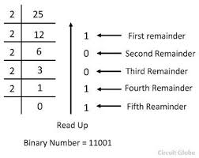

# Number system in cs

## Decimal to Binary

### common binary numbers
    0--------->00
    1--------->01
    2--------->10
    3--------->11
    4--------->100
    5--------->101
    6--------->110
    7--------->111
    8--------->1000
    9--------->1001
    10-------->1010

    lets find binary number of 25
    1 | 1 | 0 | 0 | 1
    16| 8 | 4 | 2 | 1

#    two's compliment

Two's complement is a mathematical operation used to represent negative numbers in binary. It is widely used in computer systems for arithmetic operations because it simplifies the design of addition and subtraction circuits.
How to Find the Two’s Complement of a Number:

    Write the binary representation of the number.
    Invert all the bits (0s to 1s and 1s to 0s).
    Add 1 to the result.

Example:

Let's find the two's complement of 5 (in 4-bit binary):

    55 in 4-bit binary: 0101
    Invert bits: 1010
    Add 1:

    1010
    So, **-5 in two’s complement (4-bit representation) is `1011`**.

### **Why is Two's Complement Useful?**
- It allows computers to represent both positive and negative integers.
- Addition and subtraction can be performed without needing separate subtraction logic.
- The most significant bit (MSB) acts as the sign bit (0 for positive, 1 for negative).

Would you like to see a code implementation of two's complement in Python or JavaScript? 🚀

